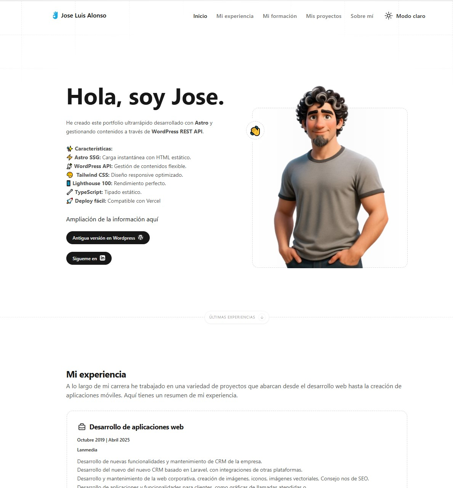

# Portfolio Personal con Astro + WordPress API

Este proyecto es un **portfolio personal desarrollado con Astro**, aprovechando las ventajas de rendimiento que ofrece este framework moderno para crear una experiencia web ultrarrápida y optimizada.

## 🌐 Producción

- URL de producción: https://joseluisalonsoredondo.es/
- Imagen CV: 

## 🚀 Rendimiento con Astro

**Astro** se destaca por su arquitectura "Zero JavaScript by default", lo que significa que:

- **Carga instantánea**: Las páginas se renderizan como HTML estático, eliminando el JavaScript innecesario
- **Hidratación selectiva**: Solo los componentes interactivos cargan JavaScript cuando es necesario
- **Optimización automática**: Minificación, tree-shaking y code-splitting están integrados
- **Core Web Vitals excelentes**: Tiempos de carga sub-segundo y puntuaciones perfectas en PageSpeed

## 📡 Integración con WordPress API

El contenido se gestiona a través de la **WordPress REST API**, proporcionando:

### Flexibilidad de contenido:
- Posts categorizados (experiencia, formación, tecnologías, aficiones)
- Gestión de medios e imágenes optimizada
- Estructura de datos consistente con WP

### Arquitectura híbrida:
```typescript
// Fetch durante build-time para SSG
const response = await fetch(`${SITE.apiBase}/wp/v2/posts?categories=${CATEGORIES.PROFILE}`);
```
### Beneficios de esta arquitectura:
- **Editor familiar**: Los contenidos se gestionan desde el panel de WordPress
- **Separación de responsabilidades**: Frontend (Astro) + Backend (WordPress)
- **Escalabilidad**: El CMS puede crecer independientemente del frontend
- **SEO optimizado**: HTML pre-renderizado con contenido dinámico

## 🛠 Características Técnicas

- **Static Site Generation (SSG)**: Páginas pre-generadas en build time
- **Gestión de categorías centralizada**: Configuración unificada en `categories.ts`
- **Componentes reutilizables**: `PostsLoop`, `TechnoCard`, `HtmlCard`
- **Manejo robusto de errores**: Fallbacks para fallos de API
- **TypeScript**: Tipado estático para mayor confiabilidad
- **Tailwind CSS**: Diseño responsive y optimizado

## 📁 Estructura del Proyecto

```
src/
├── components/
│   ├── icons/technologies/     # Iconos de tecnologías
│   ├── home/                   # Componentes de página principal
│   ├── posts-loop.astro        # Loop de posts
│   ├── technoCard.astro        # Tarjetas de tecnologías
│   └── htmlCard.astro          # Tarjetas con contenido HTML
├── config/
│   ├── site.ts                 # Configuración del sitio
│   └── categories.ts           # IDs de categorías centralizadas
├── layouts/
│   └── main.astro              # Layout principal
└── pages/
    ├── index.astro             # Página principal
    ├── about.astro             # Página sobre mí
    ├── experiences.astro       # Experiencias
    ├── studies.astro           # Formación
    └── project/[slug].astro    # Páginas dinámicas de proyectos
```

## ⚙️ Configuración

### Variables de entorno (.env)
```env
PUBLIC_BASE_URL=https://tudominio.com/
PUBLIC_API_BASE=https://tudominio.com/wp-json
PUBLIC_LINKEDIN=https://www.linkedin.com/in/tu-perfil
```

### Categorías WordPress
```typescript
export const CATEGORIES = {
  PROFILE: 1,
  STUDIES_FORMAL: 2,
  STUDIES_OTHER: 3,
  EXPERIENCE: 4,
  TECHNOLOGIES: 5,
  PORTFOLIO: 6,
  HOBBIES: 8
} as const;
```

## 🚀 Instalación y Desarrollo

```bash
# Clonar el repositorio
git clone https://github.com/tu-usuario/tu-portfolio.git

# Instalar dependencias
npm install

# Configurar variables de entorno
cp .env.example .env

# Desarrollo local
npm run dev

# Build para producción
npm run build

# Preview del build
npm run preview
```

## 📱 Características del Portfolio

- **Página principal**: Resumen de perfil, experiencias y proyectos destacados
- **Sobre mí**: Información personal, tecnologías y aficiones
- **Experiencias**: Historial laboral y profesional
- **Formación**: Educación formal y cursos complementarios
- **Proyectos**: Portfolio de trabajos con navegación entre proyectos

## 🌐 Deploy

Compatible con:
- **Vercel** (recomendado)
- **Netlify**
- **GitHub Pages**
- Cualquier hosting que soporte sitios estáticos

## 📈 Resultados

El resultado es un **portfolio que combina la velocidad de Astro con la flexibilidad de WordPress**, ofreciendo:
- Tiempos de carga < 1 segundo
- Puntuación perfecta en Lighthouse
- SEO optimizado
- Gestión de contenidos intuitiva
- Experiencia de usuario excepcional

---

Desarrollado con ❤️ usando [Astro](https://astro.build) y [WordPress](https://wordpress.org)